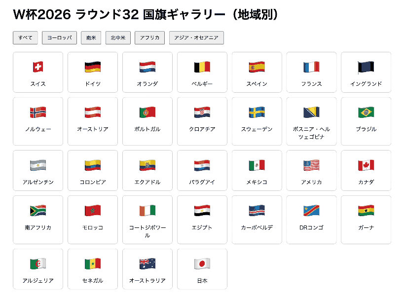

# jsQuiz-neo-08

「`querySelectorAll` で取得した要素を `filter` で絞り込み、`map` で変換する」の振り返りです。

## 課題内容

HTML に国旗カードがすべて並べてあります。地域ボタンを押したとき、`querySelectorAll` で取得したカードを `filter` でその地域だけに絞り込み、`map` で「国名の一覧」に変換し、その名前のカードだけをギャラリー上に表示（ほかは非表示）します。

**カードの取得・ボタンのクリック処理・画面への表示は `index.html` にすでに用意してあります。**
あなたの課題は、**`filter` だけを使う関数と `map` だけを使う関数の2つを書く**ことだけです。

> `querySelectorAll` が返す `NodeList` は `map`／`filter` が使えません。用意済みのコードが `Array.from(...)` で配列に変換してから、あなたの関数に渡します。



### HTML の構造（ひな形）

- ギャラリー `.gallery` の中に32枚の `<div class="card" data-category="...">`（HTML に固定で並べてある）
  - カード1枚は `.card-emoji`（国旗）と `.card-name`（国名）を持つ
  - `data-category` の値は `europe` / `southamerica` / `northamerica` / `africa` / `asia`
- フィルターボタン群 `.filter-buttons` の中に6つの `<button class="filter-btn">`
  - 「すべて」… `data-category="all"`
  - 「ヨーロッパ」… `data-category="europe"`
  - 「南米」… `data-category="southamerica"`
  - 「北中米」… `data-category="northamerica"`
  - 「アフリカ」… `data-category="africa"`
  - 「アジア・オセアニア」… `data-category="asia"`
- 非表示にするカードには `.hidden`（`display: none`）クラスが付く

### 用意済みの処理（書き換えないこと）

`index.html` の `<script>` 前半に、以下がすでに用意されています。

- `Array.from(document.querySelectorAll('.card'))` でカード要素の配列を取得
- 各ボタンの `click` イベント設定
- `toNames` の結果（表示する国名一覧）に一致するカードだけ `.hidden` を外して表示する処理（初期は HTML のまま全件表示）

ボタンを押すと、あなたが作る `filterByCategory` と `toNames` が呼ばれて、該当する地域のカードだけがギャラリー上に表示されます。
この**呼び出し側（表示処理）は完成済み**なので、**書き換えないでください**。あなたが書くのは下記の2つの関数だけです。

### あなたの課題

次の2つの関数を作ってください。引数 `cards` は**カード要素の配列**です。

1. **`filterByCategory(cards, category)`** … `filter` だけを使う
   - `cards` の中から「`data-category` が `category` と一致するものだけ」に絞り込んで `return` する。
2. **`toNames(cards)`** … `map` だけを使う
   - `cards` を、各カードの名前（`.card-name` の文字）の配列に変換して `return` する。

`filter` と `map` を1つにまとめず、**別々の関数**にするのがポイントです。

---

## 制作手順（ヒント）

用意済みの処理より**後ろ**に、`filterByCategory` と `toNames` の2つの関数を書きます。

1. `filterByCategory(cards, category)` … `cards.filter(...)` を使う
   - `filter` のコールバックで、各カードの `data-category`（＝ `card.dataset.category`）が
     引数 `category` と**一致するか**を判定して `true`／`false` を `return` する。
   - 一致したカードだけが残った配列を、関数全体として `return` する。
2. `toNames(cards)` … `cards.map(...)` を使う
   - `map` のコールバックで、各カードの中の `.card-name` の文字（テキスト）を取り出して `return` する。
   - 取り出した名前が並んだ配列を、関数全体として `return` する。

- `card.dataset.category` は `card.getAttribute('data-category')` と同じ意味です。
- カードの名前は `card.querySelector('.card-name').textContent` で取り出せます。
- `filter` と `map` を1つにまとめず、**別々の関数**として書くのがポイントです。
- コールバックの中で `console.log` するだけ（`return` し忘れ）だと空になるので注意。

---

## 提出方法

### ① Fork
このリポジトリを自分のアカウントに Fork してください。

### ② clone
自分の Fork を GitHub Desktop で clone します。

### ③ branch を作る
ブランチ名に「quiz8/自分の名前」を記入する（例：quiz8/kawaguchi）

### ④ コードを書く
`students/{自分の番号}/index.html` を編集して課題を完成させます。
（例：出席番号が 7 番なら `students/7/index.html`）

ルートの `index.html` を `students/{自分の番号}/index.html` にコピーしてから編集するのが簡単です。

### ⑤ commit / push
変更を commit して push してください。
- title：出席番号_名前（例：28_河口）
- message：提出します。

### ⑥ Pull Request を作成
元のリポジトリに向けて Pull Request を作成してください。

## 判定について

- Pull Request を出すと自動判定が実行されます
- 成功 → ✅ **合格！** のコメントが付きます
- 失敗 → ❌ **不合格** のコメントと確認ポイントが付きます

結果は PR のコメント欄と「Checks」タブで確認してください。

## ディレクトリ構成

```
jsQuiz-neo-08/
├── index.html              # 問題ファイル（参照・複製元）
├── students/               # 解答フォルダ ★ここに作業する
│   └── {自分の番号}/
│       └── index.html      # index.html を複製して解答を記述
├── .github/                # 自動判定の設定（触らない）
├── tests/                  # 自動判定の設定（触らない）
├── playwright.config.js    # 自動判定の設定（触らない）
└── README.md
```

## 注意

- `students/{自分の番号}/index.html` の `<script>` 内、**「ここから下があなたの課題です」より後ろ**だけ編集してください
- 用意済みの処理（カードの取得・ボタン処理・`.hidden` での表示/非表示）は書き換えないでください
- HTML構造（`.gallery` / `.card` / `.card-name` / `data-category` / `.filter-btn` / `.hidden`）は変えないでください
- カードの `data-category` の値（`europe` / `southamerica` / `northamerica` / `africa` / `asia`）や国名は変更しないでください
- `students/` 以外のファイルは変更しないでください
- エラーが出たら修正して再度 push してください

---

## 模範解答

授業資料の[JSQuiz_neo模範解答](https://2026doc.hideok.org/first-term/javascript/post-quizanswer)
